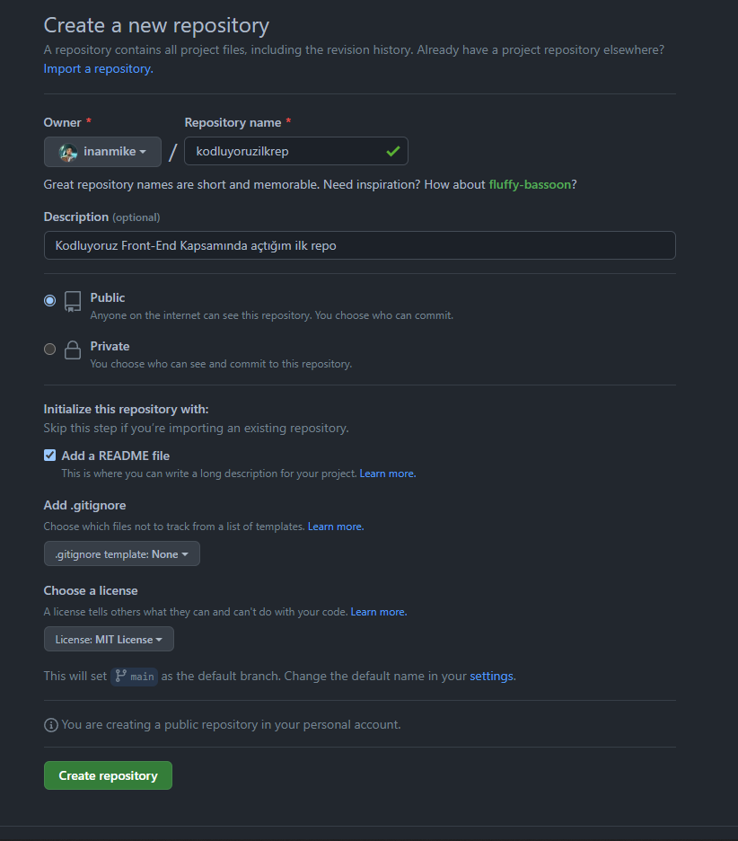

# Kodluyoruz Ilk Repo

Bu repo [Kodluyoruz](https://www.kodluyoruz.org) Front-End Eğitiminde oluşturduğumuz ilk repo. İçerisinde bir adet README dosyası, bir adet de index.html barındırıyor.



## Installation

```bash
pwd
cd Projeler/
cd kodluyoruzilkrepo/
git clone https://github.com/inanmike/kodluyoruzilkrepo.git
```

## Usage

```Windows
code kodluyoruzilkrepo
```

## Contributing

figures klasörü oluşturulup GitHub'ta yeni oluşturulan repository'nin ekran görüntüsü eklendi.
README.md dosyasının içeriği düzenlendi.
index.html dosyası oluşturuldu.

## License
[MIT](https://choosealicense.com/licenses/mit/)